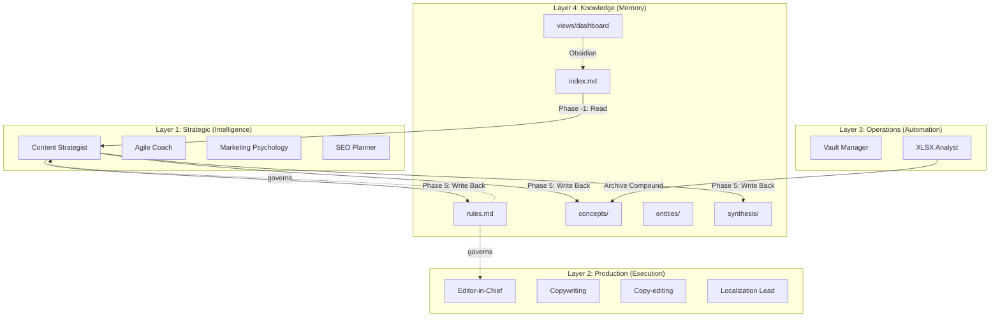

# Agentic Skills Strategy: Content Factory

This document tracks the deployment and lifecycle of agentic skills (digital employees) within the Content Factory. It outlines our 5-Phase strategy for expanding from a core team to a fully automated multi-platform production engine, plus the Knowledge Layer that makes the system self-improving.

## 🏛️ Architecture: The 4-Layer Model

Our system is organized into four functional layers:

1. **Strategic Layer (Intelligence)** — Goal setting, pillar development, and high-level design.
2. **Production Layer (Execution)** — Writing, localizing, and formatting content.
3. **Operations Layer (Automation)** — File management, publishing, and analytics.
4. **Knowledge Layer (Memory)** — Persistent, LLM-maintained wiki that compounds strategic insights across sessions.

### Knowledge Layer Details

The Knowledge Layer implements Karpathy's [LLM-Wiki pattern](https://gist.github.com/karpathy/442a6bf555914893e9891c11519de94f), adapted for content production:

| Component | Path | Purpose |
|:---|:---|:---|
| Schema | `Knowledge/SCHEMA.md` | Governing conventions, templates, and LLM maintainer rules |
| Index | `Knowledge/index.md` | Master catalog — LLM reads this first before any operation |
| Rules | `Knowledge/rules.md` | 16 confirmed + 1 proposed decision rules with maturity states |
| Log | `Knowledge/log.md` | Append-only audit trail for all operations |
| Entities | `Knowledge/entities/` | 9 pages (persons, books, algorithms, organizations) |
| Concepts | `Knowledge/concepts/` | 21 pages with Evidence tables and Counter-Arguments |
| Synthesis | `Knowledge/synthesis/` | Cross-concept analyses filed back from /produce and queries |
| Raw Sources | `Knowledge/raw/` | 4 immutable EPUB/FB2 source files |
| Dashboard | `Knowledge/views/dashboard.md` | Dataview-powered live dashboard (Obsidian only) |

**Key mechanisms:**
- **Phase -1 (Knowledge Scan):** `/produce` reads the Ledger before drafting.
- **Phase 5 (Draft Compound):** `/produce` writes insights back after Editor review.
- **Archive Compound:** `/archive` populates Evidence tables with real analytics.
- **Rule Maturity:** 🧪 Proposed → ✅ Confirmed → ❌ Rejected lifecycle.
- **Counter-Arguments:** Every concept page must challenge its own validity.
- **File-Back Loop:** Valuable syntheses from queries are filed as new wiki pages.
- **Obsidian Sync:** Directory junction — changes appear in Obsidian instantly.

---

## 🌌 Community Repository Source

All community-sourced skills originate from:

> **[Antigravity Awesome Skills](https://github.com/sickn33/antigravity-awesome-skills)** - 882+ universal agentic skills for Claude Code, Gemini CLI, Cursor, Copilot & more.

| Attribute | Value |
|-----------|-------|
| **Repo** | [sickn33/antigravity-awesome-skills](https://github.com/sickn33/antigravity-awesome-skills) |
| **Current Version** | v5.9.0 (Feb 20, 2026) |
| **Total Skills** | 882+ |
| **License** | MIT |
| **Install Path** | `.agent/skills/` |

**Skill Categories available upstream:**

| Category | Focus | Examples |
|----------|-------|----------|
| Architecture | System design, ADRs, C4 | `architecture`, `senior-architect` |
| Business | Growth, pricing, CRO, SEO | `copywriting`, `seo-audit` |
| Data & AI | LLM apps, RAG, agents | `rag-engineer`, `prompt-engineer` |
| Development | Language mastery, frameworks | `typescript-expert`, `react-patterns` |
| General | Planning, docs, writing | `brainstorming`, `writing-plans` |
| Infrastructure | DevOps, cloud, CI/CD | `docker-expert`, `aws-serverless` |
| Security | AppSec, pentesting | `api-security-best-practices` |
| Testing | TDD, test design, QA | `test-driven-development` |
| Workflow | Automation, orchestration | `workflow-automation` |

**Quick Update:** `npx antigravity-awesome-skills`

> **Note:** Custom skills (Phase 1 core team) are NOT sourced from this repo and should never be overwritten during updates.

---

## 📈 Expansion Roadmap

### Phase 1: Core Lifecycle Excellence (COMPLETED)

**Objective:** Restore missing capabilities and ensure a working foundation.

| Agent | Status | Layer | Source | Notes |
|-------|--------|-------|--------|-------|
| [Content Strategist](file:///c:/Users/kaann/.gemini/antigravity/brain/d6e3ae1d-c6f0-4f66-af5a-5d51ea3f2cc4/Automation%20with%20Obsidian/.agent/skills/content_strategist/SKILL.md) | ✅ Active | Strategic | Custom | Patched with 360 Brew algorithm constraints |
| [Master Agile Coach](file:///c:/Users/kaann/.gemini/antigravity/brain/d6e3ae1d-c6f0-4f66-af5a-5d51ea3f2cc4/Automation%20with%20Obsidian/.agent/skills/agile_coach/SKILL.md) | ✅ Active | Strategic | Custom |
| [Localization Lead](file:///c:/Users/kaann/.gemini/antigravity/brain/d6e3ae1d-c6f0-4f66-af5a-5d51ea3f2cc4/Automation%20with%20Obsidian/.agent/skills/localization_lead/SKILL.md) | ✅ Active | Strategic | Custom |
| [Creative Director](file:///c:/Users/kaann/.gemini/antigravity/brain/d6e3ae1d-c6f0-4f66-af5a-5d51ea3f2cc4/Automation%20with%20Obsidian/.agent/skills/creative_director/SKILL.md) | ✅ Active | Strategic | Custom |
| [Editor-in-Chief](file:///c:/Users/kaann/.gemini/antigravity/brain/d6e3ae1d-c6f0-4f66-af5a-5d51ea3f2cc4/Automation%20with%20Obsidian/.agent/skills/editor_in_chief/SKILL.md) | ✅ Active | Production | Custom | 18/25 Brand Voice Score rubric |
| [Vault Manager](file:///c:/Users/kaann/.gemini/antigravity/brain/d6e3ae1d-c6f0-4f66-af5a-5d51ea3f2cc4/Automation%20with%20Obsidian/.agent/skills/vault_manager/SKILL.md) | ✅ Active | Operations | Custom |
| **[Social Content](file:///c:/Users/kaann/.gemini/antigravity/brain/d6e3ae1d-c6f0-4f66-af5a-5d51ea3f2cc4/Automation%20with%20Obsidian/.agent/skills/social-content/SKILL.md)** | ✅ Restored | Production | Community |
| **[Writing Plans](file:///c:/Users/kaann/.gemini/antigravity/brain/d6e3ae1d-c6f0-4f66-af5a-5d51ea3f2cc4/Automation%20with%20Obsidian/.agent/skills/writing-plans/SKILL.md)** | ✅ Installed | Strategic | Community |
| **[D3 Visualization](file:///c:/Users/kaann/.gemini/antigravity/brain/d6e3ae1d-c6f0-4f66-af5a-5d51ea3f2cc4/Automation%20with%20Obsidian/.agent/skills/d3-viz/SKILL.md)** | ✅ Installed | Production | Community |
| ~~Document Processing~~ | ❌ Removed (2026-02-20) | Production | Community | Zero usage, not found upstream |

### Phase 2: Core Capability Sync (COMPLETED)

**Objective:** Update existing SEO and marketing skills to the latest community standards.

| Agent | Status | Layer | Source | Notes |
|-------|--------|-------|--------|-------|
| **[Marketing Psychology](file:///c:/Users/kaann/.gemini/antigravity/brain/d6e3ae1d-c6f0-4f66-af5a-5d51ea3f2cc4/Automation%20with%20Obsidian/.agent/skills/marketing-psychology/SKILL.md)**| ✅ Current | Strategic | Community | Matches latest repo version (21KB) |
| **[XLSX Analyst](file:///c:/Users/kaann/.gemini/antigravity/brain/d6e3ae1d-c6f0-4f66-af5a-5d51ea3f2cc4/Automation%20with%20Obsidian/.agent/skills/xlsx/SKILL.md)** | ✅ Active | Operations | Community | Installed with recalc scripts |
| **[SEO Fundamentals](file:///c:/Users/kaann/.gemini/antigravity/brain/d6e3ae1d-c6f0-4f66-af5a-5d51ea3f2cc4/Automation%20with%20Obsidian/.agent/skills/seo-fundamentals/SKILL.md)** | ✅ Synced | Strategic | Community | Updated to latest version (5.8KB+) |
| **[SEO Audit](file:///c:/Users/kaann/.gemini/antigravity/brain/d6e3ae1d-c6f0-4f66-af5a-5d51ea3f2cc4/Automation%20with%20Obsidian/.agent/skills/seo-audit/SKILL.md)** | ✅ Synced | Strategic | Community | Updated to latest version (12KB+) |

### Phase 3: Content Mastery (COMPLETED)

**Objective:** Advanced copywriting, prompt engineering, and SEO content planning.

| Agent | Status | Layer | Source | Notes |
|-------|--------|-------|--------|-------|
| **[Content Creator](file:///c:/Users/kaann/.gemini/antigravity/brain/d6e3ae1d-c6f0-4f66-af5a-5d51ea3f2cc4/Automation%20with%20Obsidian/.agent/skills/content-creator/SKILL.md)** | ✅ Installed | Production | Community | SEO-optimized marketing content (7.3KB) |
| **[Copywriting](file:///c:/Users/kaann/.gemini/antigravity/brain/d6e3ae1d-c6f0-4f66-af5a-5d51ea3f2cc4/Automation%20with%20Obsidian/.agent/skills/copywriting/SKILL.md)** | ✅ Installed | Production | Community | Conversion-focused marketing copy (5.2KB) |
| **[Copy-editing](file:///c:/Users/kaann/.gemini/antigravity/brain/d6e3ae1d-c6f0-4f66-af5a-5d51ea3f2cc4/Automation%20with%20Obsidian/.agent/skills/copy-editing/SKILL.md)** | ✅ Installed | Production | Community | Seven Sweeps review framework (12.9KB) |
| **[Prompt Engineer](file:///c:/Users/kaann/.gemini/antigravity/brain/d6e3ae1d-c6f0-4f66-af5a-5d51ea3f2cc4/Automation%20with%20Obsidian/.agent/skills/prompt-engineer/SKILL.md)** | ✅ Installed | Strategic | Community | 11 prompting frameworks (11KB) |
| **[SEO Content Planner](file:///c:/Users/kaann/.gemini/antigravity/brain/d6e3ae1d-c6f0-4f66-af5a-5d51ea3f2cc4/Automation%20with%20Obsidian/.agent/skills/seo-content-planner/SKILL.md)** | ✅ Installed | Strategic | Community | Topic clusters & content calendars (2.6KB) |

### Phase 3.5: Knowledge Layer (COMPLETED — 2026-04-05)

**Objective:** Make the system self-improving by adding persistent memory.

| Component | Status | Purpose |
|-----------|--------|---------|
| **Knowledge Ledger** (Karpathy LLM-Wiki) | ✅ Active | Persistent wiki: 30 concept/entity pages, 16 confirmed rules, 4 raw sources |
| **`/ingest` workflow** | ✅ Active | Capture external inspiration (books, articles) as immutable raw sources |
| **`/lint` workflow** | ✅ Active | Health-check for staleness, skill drift, orphan pages, bias risk |
| **Draft Compound** (Phase 5 of `/produce`) | ✅ Active | Write-back: files rules, stub entities, and synthesis during drafting |
| **Archive Compound** (Phase 5 of `/archive`) | ✅ Active | Populates Evidence tables with real analytics; confirms/rejects rules |
| **Rule Maturity States** | ✅ Active | 🧪 Proposed → ✅ Confirmed → ❌ Rejected lifecycle |
| **Counter-Arguments & Data Gaps** | ✅ Active | Anti-confirmation-bias mechanism on all concept pages |
| **Query → File Back** | ✅ Active | Synthesis pages preserve cross-concept analyses |
| **Dataview Dashboard** | ✅ Active | Live Obsidian dashboard with stale page detection |
| **Obsidian Symlink** | ✅ Active | Directory junction — zero-sync between repo and vault |

### Phase 4: Workflow Automation (Future Expansion)

**Objective:** Direct integration with publishing platforms.

- **LinkedIn Automation** (Composio MCP)
- **Canva Automation** (Composio MCP)
- **YouTube Summarizer**

### Phase 5: Multi-Platform Scale (Future Expansion)

**Objective:** Reach beyond LinkedIn.

- **Email Sequence**
- **Instagram Automation**
- **Twitter Automation**

---

## 🔄 Workflow Integration Map

| Workflow | Knowledge Layer Hooks | Skills Invoked |
|:---|:---|:---|
| `/produce` | Phase -1: Knowledge Scan (read) → Phase 5: Draft Compound (write) | Agile Coach, Marketing Psychology, Editor-in-Chief, Content Strategist, Localization Lead |
| `/archive` | Phase 5: Archive Compound (write evidence + confirm rules) | Vault Manager, XLSX Analyst |
| `/ingest` | Full lifecycle: raw → entity/concept pages → index → log | *(LLM-direct, no skill invocation)* |
| `/lint` | Full scan: staleness, divergences, orphans, empty counter-arguments | *(LLM-direct, no skill invocation)* |

---

## 🛠️ Skill Maintenance & Governance

- **Community Sync:** Every quarter, compare local versions against [antigravity-awesome-skills](https://github.com/sickn33/antigravity-awesome-skills).
- **Customization:** Core Team skills (1-6) are customized for brand voice and should only be updated manually.
- **Knowledge Precedence:** Skills are operational constants; Knowledge Ledger is the dynamic layer. When they diverge, `/lint` flags it — skills are never auto-updated.
- **Verification:** All new skill deployments must be verified with `ls -R .agent/skills` and confirmed valid metadata.

---

*Last Updated: 2026-04-05*
*Community Repo Version at Last Check: v5.9.0*
*Knowledge Layer Version: v2 (counter-arguments, Dataview, rule maturity, file-back)*
