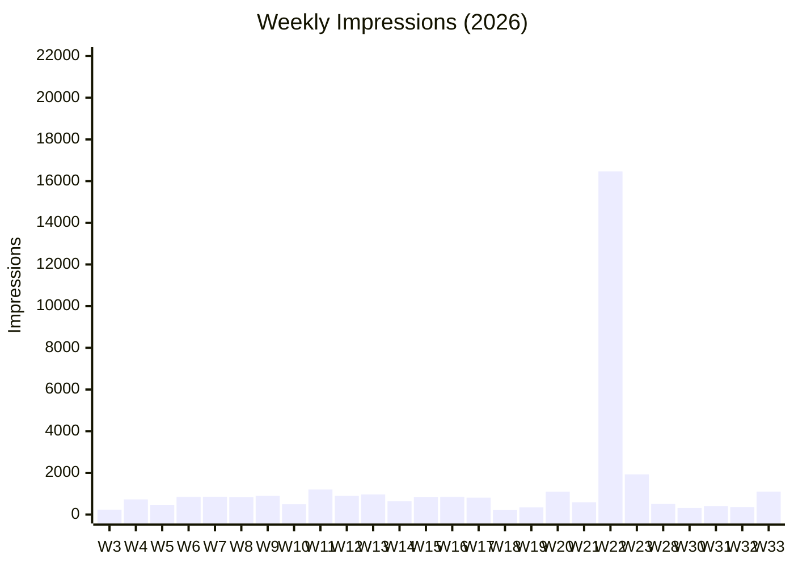

# 📊 LinkedIn Content Dashboard

## 📊 2026 Goals

| Metric | Target | H1 Actual | H2 Target |
|--------|--------|-----------|-----------|
| Total posts | 1/week | 53 published | +18 (1/week) |
| Articles | 1 every 2 months | 5 published | +2 more |
| Turkish posts | Every other Thursday | 8 published (28,373 imps) | +10 (originals + translations) |
| Follower growth | **+10% YoY (1,373)** | 1,348 (+100 since Jan 1) 🟢 | **1,373** (+25 more needed) |
| **Posting cadence** | **Thursday only, 09:00 TRT** | ~~2x/week~~ revised to 1x/week | **1x/week (Thu)** |
| **Saves (Kaydetmeler)** | Track per post | 19 saves (17 in H1, 2 in Q3 W28) | Continue tracking |
| **Videos** | 1/month from Aug | 1 (Lighthouse Keeper) | +2 (pilot) |
| **Strategy reviews** | Monthly (last Fri) | 2 (Q1 + Q2) | +6 (monthly) |

## 📈 Weekly Performance (Data Bridge)

<!-- DATA_BRIDGE_START -->

<!-- DATA_BRIDGE_END -->

**Current ATH:** Week 22 — **16,463 impressions** 🏆🏆🏆 (TR Facilitator's Silence viral — finalized at 22,983)
**W33 (Aug 10-16):** AI Certificate (Data Labelling) = **689** (20 reactions 🏆, 4 profile views) + TR Kahramanlık Tuzağı = **411**
**W31 (Jul 27-Aug 2):** The Analyst's Notebook = **405** (3 comments ⭐, 1 repost ⭐)
**W28 (Jul 6-12):** TR Takımın Gölgesi = **508** (2 saves 🏆 — 0.39% save rate, highest non-viral save rate!)
**Followers:** **1,348** total (+100 since Jan 1). Target 1,373 year-end → on track (+25 needed).
**Audience:** Senior+Director+VP = **55-68%** consistently. CXO 3%, VP 2%.

## 📝 Recent Content
<!-- RECENT_CONTENT_START -->
| *Aug 27* | 🇬🇧 [[2026-08-27_The_Silent_Manager_Alignment|The Silent Manager Alignment]] ⏳ Tracking [🔗](https://www.linkedin.com/posts/kaannarter_a-deadline-was-slipping-nobody-came-to-me-share-7498462984332177408-mDCb) 216 imps (3d), 1 rx |
| Date       | Article                  |
|------------|---------------------------|
| *Aug 13*   | 🇹🇷 [[TR_Kahramanlik_Tuzagi]] ✅ Published [🔗](https://www.linkedin.com/posts/kaannarter_sprintinizdeki-en-tehlikeli-darbo%C4%9Faz-d%C3%BC%C5%9F%C3%BCk-share-7492942417013370880-fOpU) 411/3d |
| *Aug 12*   | 📝 [[2026-08-12_AI_Certificate_Labelling]] ✅ Published [🔗](https://www.linkedin.com/posts/activity-7493367217074470912-inOA) 🏆 689 imps, 20 reactions 🏆, 4 profile views |
| *Aug 9*    | 📝 [[2026-08-09_The_Efficiency_Trap]] ✅ Published [🔗](https://www.linkedin.com/posts/kaannarter_the-sprint-was-a-success-every-item-done-ugcPost-7491927200083091457-4fRV) 361 imps |
| *Jul 29*   | 📝 [[2026-07-29_The_Analysts_Notebook]] ✅ Published [🔗](https://www.linkedin.com/posts/kaannarter_%F0%9D%98%90-%F0%9D%98%B6%F0%9D%98%AF%F0%9D%98%A5%F0%9D%98%A6%F0%9D%98%B3%F0%9D%98%B4%F0%9D%98%B5%F0%9D%98%B0%F0%9D%98%B0%F0%9D%98%A5-%F0%9D%98%A2%F0%9D%98%AD%F0%9D%98%AE%F0%9D%98%B0%F0%9D%98%B4%F0%9D%98%B5-%F0%9D%98%AF%F0%9D%98%B0%F0%9D%98%B5%F0%9D%98%A9%F0%9D%98%AA%F0%9D%98%AF%F0%9D%98%A8-share-7487900938377293825-jZHn) 405 imps, 3 comments ⭐, 1 repost ⭐ |
| *Jul 25*   | 📝 [[Hero_Trap_Phoenix_Project]] ✅ Published [🔗](https://www.linkedin.com/posts/kaannarter_%F0%9D%90%93%F0%9D%90%A1%F0%9D%90%9E-%F0%9D%90%87%F0%9D%90%9E%F0%9D%90%AB%F0%9D%90%A8-%F0%9D%90%93%F0%9D%90%AB%F0%9D%90%9A%F0%9D%90%A9-the-most-dangerous-share-7486466701878947840-hmAj) 315 imps |
| *Jul 9*    | 🇹🇷 [[TR_Takimin_Golgesi]] ✅ Published [🔗](https://www.linkedin.com/posts/kaannarter_tak%C4%B1m%C4%B1n-g%C3%B6lgesi-kolayla%C5%9Ft%C4%B1r%C4%B1c%C4%B1l%C4%B1%C4%9F%C4%B1n%C4%B1-%C3%BCstlendi%C4%9Finiz-share-7480337769177817088-VIUW) 🏆 508 imps, 2 saves (0.39% save rate!) |
| *Jun 30*   | 🇹🇷 [[TR_The_Calm_Mind]] ✅ Published [🔗](https://www.linkedin.com/posts/kaannarter_sprint-review-g%C3%BCn%C3%BC-yakla%C5%9F%C4%B1yordu-al%C4%B1%C5%9F%C4%B1k-share-7477387664514727937-d3_x) 552 imps (FINAL) |
| *Jun 18*   | 📝 [[The_Rescue_Nobody_Asked_For]] ✅ Published [🔗](https://www.linkedin.com/feed/update/urn:li:activity:7473253249610084352) 186 imps |
| *Jun 16*   | 📝 [[When_You_Are_The_Bottleneck]] ✅ Published [🔗](https://www.linkedin.com/feed/update/urn:li:activity:7472528477368537088) 216 imps |
| *Jun 11*   | 📝 [[The_Favorite_Weapon]] ✅ Published [🔗](https://www.linkedin.com/feed/update/urn:li:activity:7470716538195431424) 203 imps |
| *Jun 9*    | 📝 [[Inner_Citadel]] ✅ Published [🔗](https://www.linkedin.com/feed/update/urn:li:activity:7469991705157586944) 290 imps |
| *Jun 4*    | 📝 [[Sprint_That_Ate_Itself]] ✅ Published [🔗](https://www.linkedin.com/posts/kaannarter_my-team-delivered-50-more-story-points-than-share-7467970750638112769-U-as) ⭐⭐ 4,430 imps (FINAL) — 7 saves! |
| *Jun 2*    | 🇹🇷 [[TR_Perception_Is_Strong]] ✅ Published [🔗](https://www.linkedin.com/feed/update/urn:li:activity:7467233174830419969) 793 imps (FINAL), 1 save |
<!-- RECENT_CONTENT_END -->

## 🏦 Pillar Balance (54 items, Q3 Week 35)

| Pillar | Total Count | Current % | Q3 Target | Gap | Status |
|--------|:-----:|:-:|:------:|:---:|:---|
| AI in Scrum | 10 | 18.5% | **20%** | -1.5pp 🟢 | WIP limit: 2/quarter |
| Manager Partnership | 21 | 38.9% | **35%** | +3.9pp 🟡 | Engine: 4/month |
| Psychological Safety | 12 | 22.2% | **25%** | -2.8pp 🟢 | Steady: 2-3/month |
| Continuous Improvement | 11 | 20.4% | **20%** | +0.4pp 🟢 | Target achieved! |

## 💬 Recent Engagements
<!-- ENGAGEMENTS_START -->
| Date             | Topic                             | Context                                            | Link                                                                                 |
|------------------|-----------------------------------|----------------------------------------------------|--------------------------------------------------------------------------------------|
|                  | AI Agents & MCP                   | Responded to ex-colleague (Beyza) about "Tools"... | [Comment](https://www.linkedin.com/feed/update/urn:li:activity:7416833640472469504/) |
| January 18, 2026 | Cruising vs. Intentional Learning | Replied to Danish Soomro's post on autopilot vs... | [Danish's Post](https://www.linkedin.com/in/danishsoomro/)                           |
| January 21, 2026 | Documenting LinkedIn Journey      | Commented on the importance of building in public. | [Self-Reference](https://linkedin.com)                                               |
| January 28, 2026 | Decision Drift & Leadership       | Replied to Danish Soomro about "Local Rationality" & Manager Partnership. | [Danish's Article](https://www.linkedin.com/pulse/decision-drift-why-good-decisions-quietly-lose-force-danish-soomro-oiq7f/) |
| February 2, 2026 | DevOps for Scrum Masters          | Replied about using AI as a "translator" to understand engineering context. | [Prashant's Post](https://www.linkedin.com/posts/prashant8888_scrummaster-devops-agiledelivery-share-7423747817837445120-IbXm) |
| February 2, 2026 | Moltbook & AI "Collective Intelligence" | Pushed back on hype—framed as "guided agents" not true emergence. | [Mei's Post](https://www.linkedin.com/posts/mei767_ai-moltbook-artificialintelligence-ugcPost-7423941831236829184-dcPw) |
| February 7, 2026 | Scrum is Dead (AI Impact) | Replied to Yvan Saule's CTO-level post with nuanced practitioner take. | [Yvan's Post](https://www.linkedin.com/posts/yvansaule_scrum-is-dead-and-ai-killed-it-sprints-share-7425235389554106368-Wkey) |
| February 13, 2026 | Daily Kaizen & Retro Pushback | Danish Soomro commented on our post — agreed on frequency, pushed back on retro depth. 3-comment thread. | [Our Post](https://www.linkedin.com/posts/kaannarter_tuesday-i-wrote-about-stealing-kaizen-from-share-7425935297902788608-K8N6) |
| February 17, 2026 | Decision Drift — Danish Soomro Reply | Danish Soomro commented on our post — validated the real sprint example. "Drift enters through accommodation." | [Our Post](https://www.linkedin.com/posts/activity-7429412036293361666-nvCF) |
| February 17, 2026 | AI in Higher Education — Pushback | Pushed back on Dr. Özgür Ertem's claim that universities "adapt and evolve." | [Özgür's Post](https://www.linkedin.com/posts/ozgurertem_highereducation-ai-futureofwork-share-7429443687291650050-H2II) |
| February 18, 2026 | AI Adoption Gap — Practitioner Reframe | Commented on Fred Deichler's post about 96% of SMs not trying AI tools. | [Fred's Post](https://www.linkedin.com/posts/freddeichler_i-shared-an-ai-meeting-tool-with-25-scrum-activity-7429894554390183937-88H8) |
| February 20, 2026 | **First External Mention** — Fred Deichler Follow-Up | Fred Deichler (5,120 followers) named us in his follow-up post as the practitioner using AI as "Red Team" in refinement. | [Fred's Post](https://www.linkedin.com/feed/update/urn:li:activity:7430619615686418432?commentUrn=urn%3Ali%3Acomment%3A%28activity%3A7430619615686418432%2C7430640379580006401%29) |
| February 21, 2026 | Tom Brekke Reply — AI in Refinement | Addressed orthodox Agile critique ("stories should be simple inputs"). Reframed AI not as a crutch for bad POs, but as a self-learning sparring partner. | [Tom's Comment](https://www.linkedin.com/feed/update/urn:li:activity:7430619615686418432?commentUrn=urn%3Ali%3Acomment%3A%28activity%3A7430619615686418432%2C7430640379580006401%29&replyUrn=urn%3Ali%3Acomment%3A%28activity%3A7430619615686418432%2C7430985183526395904%29) |
| March 12, 2026 | Vibe Coding vs. Agentic Engineering (Turkish) | Replied to Levent Abo explaining Karpathy's shift from vibe coding to autonomous AI dev teams. | [Levent's Post](https://www.linkedin.com/posts/leventabo_vibecoding-productmanagement-aitrends-share-7436831679589060608-4HEZ?utm_source=share&utm_medium=member_desktop&rcm=ACoAAAL9HlYBVV-QK79WCeuVNDCM-HU3VfeEdB0) |
| April 9, 2026 | **Esther Derby — Dependency Dynamic Reply** | Esther Derby commented on our Authority Borrowing post. We replied with a Statesman-level response about "constraints that bound autonomy" and the gap in manager training. Highest-authority engagement to date. | [Our Post](https://www.linkedin.com/feed/update/urn:li:activity:7447893625331462145) |
| April 21, 2026 | Dr. Özgür Ertem Reply — Leadership Pressure | Challenged the premise of leaders "already knowing" good leadership by introducing Musashi's Framework Fluidity and the danger of the fixed mindset. | [Comment](https://www.linkedin.com/feed/update/urn:li:activity:7452420259719979008/?dashCommentUrn=urn%3Ali%3Afsd_comment%3A%287452441495560892416%2Curn%3Ali%3Aactivity%3A7452420259719979008%29) |
| June 7, 2026 | Rikard Skelander Reply — Product vs. Metrics | Replied to a critique on The Sprint That Ate Itself. Reframed the focus away from story points and onto the system boundary fix. | [Comment Reply](https://www.linkedin.com/feed/update/urn:li:activity:7468179787249938432/?dashCommentUrn=urn%3Ali%3Afsd_comment%3A%287469386872792768515%2Curn%3Ali%3Aactivity%3A7468179787249938432%29&dashReplyUrn=urn%3Ali%3Afsd_comment%3A%287469406590694178817%2Curn%3Ali%3Aactivity%3A7468179787249938432%29) |
| June 10, 2026 | Kevin Schlabach Reply — IT-only Scrum | Replied to a query on The Sprint That Ate Itself regarding why the business lacked DoR knowledge. Explained the IT-siloed Scrum and proxy PO anti-pattern. | [Comment Reply](https://www.linkedin.com/posts/kaannarter_my-team-delivered-50-more-story-points-than-share-7467970750638112769-U-as) |
| August 12, 2026 | 24 Claude Skills for Business Strategy | Engaged on Natan Mohart's post about 24 open-source Claude strategy skills & Python framework tools. | [Natan's Post](https://www.linkedin.com/feed/update/urn:li:activity:7493267700908146688/?dashCommentUrn=urn%3Ali%3Afsd_comment%3A%287493269286006779904%2Curn%3Ali%3Aactivity%3A7493267700908146688%29&dashReplyUrn=urn%3Ali%3Afsd_comment%3A%287493359790925082624%2Curn%3Ali%3Aactivity%3A7493267700908146688%29) |
<!-- ENGAGEMENTS_END -->

## ☕ 360 Brew Optimization Checklist

*Added Mar 2026 — LinkedIn's 360 Brew algorithm update.*

- [x] **Profile Audit:** Headline + About section reflects all 4 pillars (AI in Scrum, Manager Partnership, Psych Safety, Continuous Improvement) ✅ *Done Mar 2, 2026*
- [ ] **Golden Hour Protocol:** Reply to all comments within 60 min of posting
- [ ] **Saves Tracking:** Log `Kaydetmeler` from every LinkedIn CSV export
- [ ] **Hashtag Standard:** 0 in post body. 2-3 niche tags in **first comment only** *(updated per 360 Brew NLP rules)*
- [ ] **21-Day Window:** Extend post performance tracking from 7 → 21 days
- [ ] **Save-Worthy CTAs:** End posts with frameworks/checklists people want to bookmark
- [ ] **CTA Experiment:** Test fill-in-the-blank format vs explicit questions (Q2 experiment)
- [ ] **Turkish Cadence:** Bi-weekly (every other Thursday) — translate top performers only
