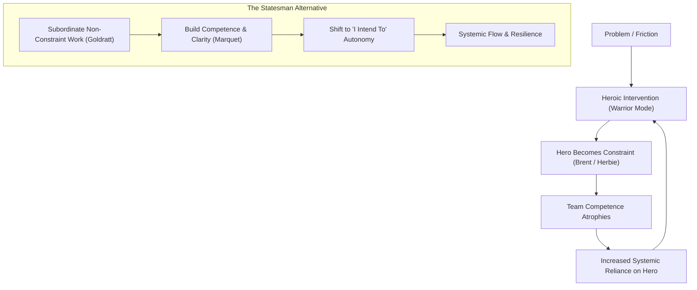

# The Systemic Bottleneck Loop: Why Heroics Undermine Intent-Based Leadership

## Question / Context
How do Eliyahu Goldratt's *Theory of Constraints*, Peter Senge's *Shifting the Burden* archetype, L. David Marquet's *Intent-Based Leadership*, and Gene Kim's *Brent Bottleneck* intersect to explain why management heroics fail, and how leaders transition from firefighting Warriors to systemic Statesmen?

## Synthesis

When a software delivery pipeline encounters friction (a complex release, ambiguous requirements, or missing QA capability), organizations almost universally trigger a **Heroics Addiction Loop** (*Senge's Shifting the Burden archetype*). 

1. **The Heroic Intervention (Symptomatic Solution):** A high-performing Tech Lead or Scrum Master steps in to manually solve the problem ("Warrior mode"). They fix the build, rewrite the story, or bypass governance.
2. **Creation of the Brent/Herbie Bottleneck:** Because the hero resolves issues fastest, all future unplanned work naturally routes to them. The hero becomes the universal constraint (*Goldratt's Herbie / Kim's Brent*).
3. **Atrophy of Fundamental Capability:** The team stops developing its own problem-solving muscle because the hero is always available. The fundamental solution (building team competence and clarity) is postponed.
4. **Efficiency Trap Breakdown:** Management attempts to optimize non-bottleneck developers by keeping them 100% busy (*Subordination vs. Activation error*), which generates more work-in-progress (WIP) that floods the hero bottleneck, exacerbating delay.

### The Structural Cure: Intent-Based Subordination

To break this loop, the leader must move from **Warrior (Force)** to **Statesman (System Architecture)**:

- **Subordinate Non-Bottlenecks (Goldratt):** Intentionally allow slack capacity in non-constraint roles rather than demanding 100% utilization. Protect the constraint (Brent) from all unplanned work.
- **Enforce "I Intend To..." (Marquet):** Replace permission-seeking ("Can I do X?") and hero-rescuing ("Let me handle X") with intent-based statements ("I intend to launch Y because Z"). 
- **Pillar Prerequisites (Competence & Clarity):** Intent-Based Leadership cannot be granted blindly. The leader must invest in technical competence and contextual clarity so the team can execute safely without the hero.

## Pages Touched
- [[hero_bottleneck]] — Explains how the "Brent" archetype is formed through unmanaged interventions.
- [[theory_of_constraints]] — Proves that optimization away from the primary bottleneck is economic waste.
- [[subordination_vs_activation]] — Demonstrates why 100% team utilization destroys delivery speed.
- [[systems_archetypes]] — Supplies the "Shifting the Burden" structural diagram for heroics addiction.
- [[intent_based_leadership]] — Provides the operational mechanism ("I intend to...") to transfer authority to information.

## Actionable Rules / Takeaways
1. **Rule 42 (Proposed):** Never optimize non-bottleneck capacity if it increases queue length in front of the primary constraint. Slack capacity is a feature, not a defect.
2. **Rule 43 (Proposed):** When a team member brings a crisis to a leader, the leader must require an "I intend to..." proposal before offering assistance.

## Filed From
`/synthesize` workflow execution, 2026-08-04.