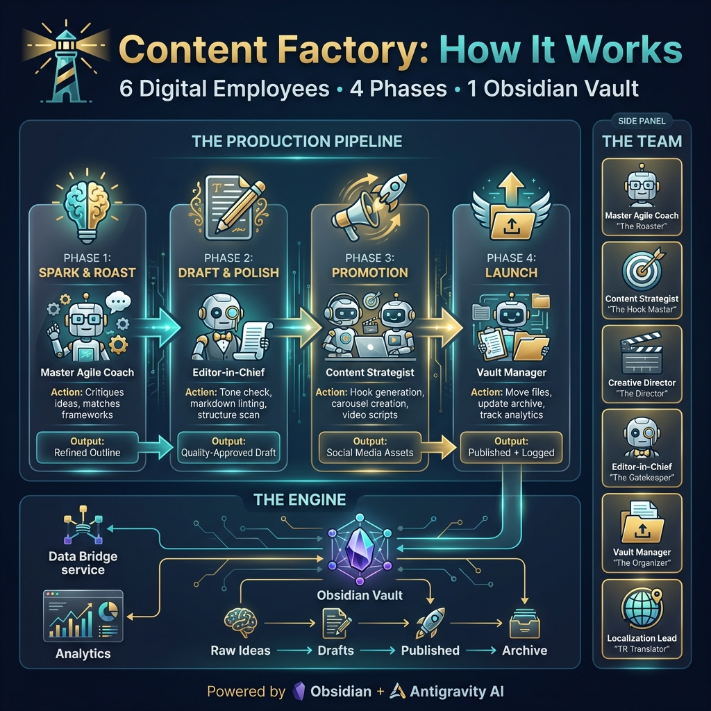

# Obsidian Content Factory

A dynamic, automated content creation system built for Obsidian. Transform your raw ideas into polished content with structured workflows, bi-lingual support, and real-time dashboards.

## 🚀 Features

- **Automated Scaffolding**: 5-part templates for consistent, high-impact posts.
- **Content Dashboard**: Track pillar distribution, publishing calendar, and repurposing opportunities.
- **Bi-Lingual Support**: Built-in collapsible sections for multi-language summaries.
- **Strategy Libraries**: Manage your proprietary frameworks and proof points.
- **Privacy-First**: Your personal content stays local; only the system structure is here.

## 🛠️ Quick Start

Check out the [Setup Guide](setup_guide.md) to build your factory from scratch.

## 📂 Repository Structure

- `.agent/`: Contains the core automation logic, workflows, agentic skills, rules, and Python data bridge services.
- `setup_guide.md`: Step-by-step instructions for Obsidian Content Factory setup.
- `content_factory_infographic.png`: Visual overview of the system.

## 🤝 Contributing

This is a personal automation toolkit. Feel free to fork and adapt it to your own workflow!
