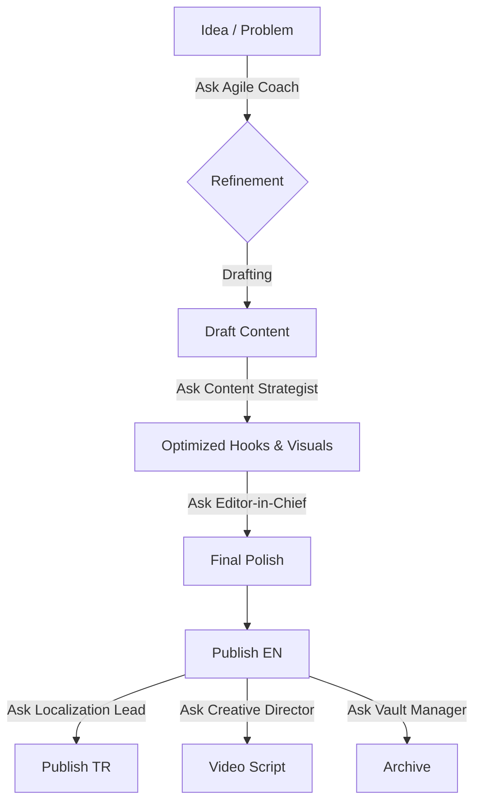

# Obsidian Content Factory: Setup Guide

This guide will help you set up an automated content factory in Obsidian, migrating from manual workflows (like Notion) to a dynamic, template-driven system.

## ✅ What You'll Have When Done

- **Post Scaffold Template** (Pattern → Mini-case → Diagram → Try this week → Tradeoff question)
- **Bilingual workflow** (EN + collapsible 🇹🇷 sections)
- **Content Dashboard** showing pillar distribution, publishing calendar, and metrics
- **Frameworks Library** cataloging your signature concepts
- **Proof Points Library** for quick metric insertion
- **Article Archive** with repurposing tracker

## 🧠 Agentic Skills (The AI Team)

This system incorporates 19 pre-configured Agentic Skills to run the factory, split between Custom Core Workflow personas and Community/Utility skills:

### Core Workflow Skills (Custom Personas)
1. **Content Strategist** (`@content_strategist`): Repurposing, hook generation, and scheduling.
2. **Agile Coach** (`@agile_coach`): Critiques drafts and provides framework roasting.
3. **Localization Lead** (`@localization_lead`): Translates content to Turkish with cultural nuance.
4. **Creative Director** (`@creative_director`): Converts text articles into video scripts.
5. **Editor-in-Chief** (`@editor_in_chief`): QA checks for tone and formatting.
6. **Vault Manager** (`@vault_manager`): Handles file lifecycle (Draft -> Published -> Archive).

### Community & Utility Skills
7. **avoid-ai-writing**: Audits drafts to clean out 21 categories of AI writing patterns.
8. **obsidian-cli**: Command line integrations to query and write vault files.
9. **xlsx**: Advanced spreadsheet parsing and manipulation.
10. **obsidian-bases**: Schema validation helper.
11. **copy-editing**: Supporting copy-editor assistant.
12. **social-content**: Platform-specific optimizations.
13. **copywriting**: Sales and marketing copy templates.
14. **idea-darwin**: Ideation evolutionary sparring partner.
15. **marketing-psychology**: 70+ marketing psychological principles and checklists.
16. **seo-content-planner**: Outlining topic clusters.
17. **json-canvas**: Standard visual mapping node builder.
18. **obsidian-markdown**: Infrastructure markdown syntax helper.
19. **skill-sentinel**: Core skills health and dependency scanner.

## 🔄 The System Workflow



---

## Step 1: Create Folder Structure

In your Obsidian vault, create these folders:

```
LinkedIn-Content/
├── _templates/
├── Drafts/
├── Published/
│   ├── 2026/
│   └── Archive/
├── Content-Strategy/
└── Assets/
    └── Diagrams/
```

**How to do it:**

1. Right-click in Obsidian file explorer → New folder
2. Create each folder listed above

---

## Step 2: Install Required Plugins

Go to `Settings` → `Community Plugins` → `Browse` and install:

1. **Templater** (essential for dynamic templates)
2. **Dataview** (for content dashboard)
3. **Tasks** (for workflow tracking)
4. **Kanban** (optional - visual content pipeline)
5. **Calendar** (optional - visual posting schedule)

**Enable each plugin** after installation in `Settings` → `Community Plugins`.

---

## Step 3: Configure Templater

1. Go to `Settings` → `Templater`
2. Set **Template folder location** to: `LinkedIn-Content/_templates`
3. Enable **Trigger Templater on new file creation**
4. Click **Save**

---

## Step 4: Create Core Templates

### Template 1: Post Scaffold Template

Create: `LinkedIn-Content/_templates/Post-Scaffold.md`

Use this template as a starting point. It uses Templater code (`<% ... %>`) to auto-fill dates and titles. Customize the structure (Pattern, Mini-Case, etc.) to match your own writing formula.

```markdown
---
pillar: 
kind: 
status: Draft
created: <% tp.date.now("YYYY-MM-DD") %>
linkedin_url: 
---

# <% tp.file.title %>

## 1️⃣ [Your Hook / Opening Section]
[Describe the recurring problem, observation, or hook here]

## 2️⃣ [Your Evidence / Mini-Case]
[Provide examples, before/after metrics, or a mini-story]

## 3️⃣ [Your Visual / Diagram]
![[diagram-name.png]]
*[Create diagram in Assets/Diagrams/]*

## 4️⃣ [Actionable Advice]
- [ ] [Your actionable steps for the reader]

## 5️⃣ [Engagement / Tradeoff Question]
*[Question that prompts comments]*

---

> [!info]- 🇹🇷 Türkçe Özet
> [Bilingual Summary Section]
> 
> **Action:** [Translated Action]

---

## Metadata
**Pillar:** `=this.pillar`
**Status:** `=this.status`
**Created:** `=this.created`
```

### Template 2: Article Template

Create: `LinkedIn-Content/_templates/Article-Template.md`

This is a longer-form template. Adapt the headers to fit your specific article structure (e.g. "The Problem," "The Solution," "The Framework").

```markdown
---
pillar: 
kind: 
status: Draft
created: <% tp.date.now("YYYY-MM-DD") %>
linkedin_url: 
frameworks_used: []
metrics_used: []
---

# <% tp.file.title %>

## Hook
[Opening story or observation]

## The Core Concept
[Explain the broader principle or framework]

## Case Study / Example
**Context:** 
**Challenge:** 
**Approach:** 
**Results:** 

## The Framework
[Your signature framework explanation]

![[framework-diagram.png]]

## Practical Application
1. [Step 1]
2. [Step 2]
3. [Step 3]

## Tradeoff Question
*[Question that reveals priorities]*

---

> [!info]- 🇹🇷 Türkçe Özet
> ### [Article Title in Turkish]
> 
> [Full Turkish summary]

---

## Metadata
**Frameworks:** `=this.frameworks_used`
**Metrics:** `=this.metrics_used`
**Status:** `=this.status`
```

---

## Step 5: Create Content Strategy Documents

### Document 1: Frameworks Library

Create: `LinkedIn-Content/Content-Strategy/Frameworks-Library.md`

This document serves as a database of your intellectual property. List your unique concepts here so you can easily link to them in your posts.

```markdown
# Frameworks Library

Your signature intellectual property - reference these in posts.

## [Framework Name]
**Definition:** [One sentence definition]
**When to use:** [Context]
**Related articles:** [[Link to article]]

---

## [Another Framework]
**Definition:** ...
**When to use:** ...
```

### Document 2: Proof Points Library

Create: `LinkedIn-Content/Content-Strategy/Proof-Points-Library.md`

Store your "wins" and data points here for quick access.

```markdown
# Proof Points Library

Quick-insert metric callouts for your posts.

## [Result/Metric Name]
**Metric:** [e.g. 50% increase]
**Context:** [Short explanation]
**Use in:** [Topic/Pillar]

---

## [Another Result]
**Metric:** ...
**Context:** ...
```

### Document 3: Content Pillars

Create: `LinkedIn-Content/Content-Strategy/Content-Pillars.md`

Define what you write about. This helps you stay focused and categorize your content.

```markdown
# Content Pillars

## Distribution Target
- **Pillar A (TOFU):** 30%
- **Pillar B (MOFU):** 30%
- **Pillar C (MOFU):** 25%
- **Pillar D (BOFU):** 15%

## Pillar 1: [Name] (TOFU/Education)
**Focus:** [What is this pillar about?]
**Sub-topics:**
- Topic 1
- Topic 2
**Post scaffold:** [Your formula]

---

## Pillar 2: [Name] (MOFU/Case Studies)
**Focus:** [What is this pillar about?]
**Sub-topics:**
- Topic A
- Topic B
```

---

## Step 6: Create Content Dashboard

Create: `LinkedIn-Content/LinkedIn-Dashboard.md`

**Note:** This dashboard uses the `dataview` plugin to query your content. Ensure you have the `status` and `pillar` fields in your frontmatter (YAML) as shown in the templates.

```markdown
# 📊 LinkedIn Content Dashboard

## 📅 Publishing Calendar (Next 4 Weeks)

```dataview
TABLE status as Status, pillar as Pillar, created as Created
FROM "LinkedIn-Content/Drafts"
WHERE status = "Scheduled" OR status = "Ready"
SORT created ASC
LIMIT 10
\```

---

## 🎯 Pillar Distribution

```dataview
TABLE pillar as Pillar, length(rows) as Count
FROM "LinkedIn-Content/Published"
GROUP BY pillar
\```

---

## 🇹🇷 Bilingual Tracker

**Posts needing full Turkish version** (every 3-4 posts):

```dataview
TABLE created as Date, pillar as Pillar
FROM "LinkedIn-Content/Published/2026"
WHERE !contains(file.content, "🇹🇷 Türkçe Özet")
SORT created DESC
LIMIT 5
\```

---

## 📈 Recent Published

```dataview
TABLE pillar as Pillar, created as Published, linkedin_url as "LinkedIn"
FROM "LinkedIn-Content/Published/2026"
SORT created DESC
LIMIT 10
\```

---

## ✍️ Current Drafts

```dataview
TABLE status as Status, pillar as Pillar, created as Started
FROM "LinkedIn-Content/Drafts"
WHERE status = "Draft" OR status = "In Progress"
SORT created DESC
\```
```

---

## Step 7: Test Your Setup

1. **Create a test post:**
   - Press `Ctrl+N` (new note)
   - Save it in `LinkedIn-Content/Drafts/`
   - Use Templater: `Ctrl+P` → "Templater: Insert Template" → Select "Post-Scaffold"

2. **Fill in the template:**
   - Add a pillar (e.g., "Education")
   - Fill in the 5 sections

3. **Check the dashboard:**
   - Open `LinkedIn-Dashboard.md`
   - Verify your draft appears in "Current Drafts"

---

## 🎉 You're Ready

You now have a fully functional content factory!

---

## Step 8: Antigravity 2.0 Agentic Layer Setup

The Obsidian Content Factory integrates with the **Antigravity 2.0 Agentic Layer**, which acts as an otonom supervisor and execution engine. This layer manages quality assurance, cultural localization, and performance feedback loops.

### 1️⃣ Dynamic Subagent Orchestration
Instead of overloading a single conversation context, the system utilizes a network of specialized **subagents** spawned dynamically in the background using `define_subagent` and `invoke_subagent` calls:

*   **@agile_coach:** Critiques retrospective plans and strategies using the framework library ("Roasting").
*   **@editor_in_chief:** Audits drafts to enforce brand voice and clean out AI writing patterns.
*   **@localization_lead:** Performs nuanced translations of English posts into corporate Turkish.
*   **@content_strategist:** Generates engaging hooks (Vulnerable, Provocative, Visual) and carousel scripts.
*   **@vault_manager:** Coordinates file operations (moving drafts, organizing folders, and updating logs).

### 2️⃣ Windows Environment & Turkish Character Handling
To prevent `UnicodeEncodeError` (charmap) exceptions when parsing LinkedIn analytics files (`.xlsx` or `.csv`) containing Turkish characters (ı, ş, ğ, ç, ö, ü) on Windows, the following coding standards must be applied:

1.  **Forced UTF-8 PowerShell Execution:** Run all Python parsing scripts with the UTF-8 environment variable set:
    ```powershell
    $env:PYTHONIOENCODING="utf-8"; python script_name.py
    ```
2.  **Stream Reconfiguration:** Reconfigure python standard output/error buffers to UTF-8 at the top of extraction scripts:
    ```python
    import sys, io
    if sys.stdout.encoding != 'utf-8':
        sys.stdout = io.TextIOWrapper(sys.stdout.buffer, encoding='utf-8')
    if sys.stderr.encoding != 'utf-8':
        sys.stderr = io.TextIOWrapper(sys.stderr.buffer, encoding='utf-8')
    ```
3.  **UTF-8 File Dumps:** Avoid printing raw extracted data to standard output. Instead, write metrics to UTF-8 JSON files using `ensure_ascii=False`:
    ```python
    import json
    with open('data_output.json', 'w', encoding='utf-8') as f:
        json.dump(metrics, f, ensure_ascii=False, indent=2)
    ```

### 3️⃣ Behavior Safeguards via JSON Hooks
To prevent AI writing artifacts (e.g., words like *"delve"*, *"tapestry"*, *"in conclusion"*) and enforce frontmatter schemas before any content is saved, we utilize `.agent/hooks.json`. These hooks intercept writing requests and reject drafts that violate brand constraints, forcing the AI to self-correct before saving.

### 4️⃣ Background Scheduled Tasks (Optional)
To automate routine audits or data ingests, you can schedule background cron jobs using the time-delay `schedule` tool. For example, a bi-weekly health check (`/lint`) or weekly analytics log update (`/archive`) can be configured to run asynchronously in the background.
*Note: Scheduled background tasks are currently supported but not active; they can be initialized as needed using the `schedule` command.*

---

## Step 9: The LLM Wiki / Memory Layer (Knowledge Ledger)

Based on Andrej Karpathy's LLM Wiki concept, the Content Factory implements a persistent **Memory Layer** (located in the `Knowledge/` directory) that sits between raw experience (analytics, logs, raw ebooks) and content production. This prevents valuable insights from evaporating into chat history and allows knowledge to compound over time.

### 1️⃣ The Directory Architecture
The Knowledge Ledger is structured as follows:
*   `SCHEMA.md`: Standard conventions, templates, and operational instructions.
*   `index.md`: Master catalog of all active entities and concepts (read first by the LLM).
*   `log.md`: Chronological log of all system upgrades, ingests, and production cycles.
*   `rules.md`: Evolving decision rules categorized by status (`🧪 Proposed`, `✅ Confirmed`, `❌ Rejected`).
*   `entities/`: Dossiers on referenced thought leaders, algorithms (e.g., `360_brew`), or tools.
*   `concepts/`: Strategic patterns (e.g., `stories_vs_frameworks`, `authority_borrowing`) containing empirical evidence and counter-arguments to avoid confirmation bias.
*   `synthesis/`: Cross-concept analyses filed back to the vault during research.

### 2️⃣ The Compounding Loop (Query ➔ File Back)
Knowledge is not static; it grows dynamically through two primary operations:

```
                  ┌─────────────────────────────────────┐
                  │          Raw Experience             │
                  │   (Drafting Posts & Ingesting Data) │
                  └──────────────────┬──────────────────┘
                                     │
                                     ▼
        ┌────────────────────────────────────────────────────────┐
        │ /produce Phase 5: Draft Compound                       │
        │ - Proposes new rules into rules.md (🧪 Proposed)        │
        │ - Files new synthesis notes (Query ➔ File Back)        │
        └────────────────────────────┬───────────────────────────┘
                                     │
                                     ▼
                  ┌─────────────────────────────────────┐
                  │       Knowledge Ledger (Wiki)       │
                  │  (Persistent, Evolving Memory Layer)│
                  └──────────────────┬──────────────────┘
                                     │
                                     ▼
        ┌────────────────────────────────────────────────────────┐
        │ /archive Phase 5: Archive Compound                     │
        │ - Updates concept evidence tables with actual numbers  │
        │ - Promotes/Graduates rules to ✅ Confirmed or ❌ Rejected│
        └────────────────────────────────────────────────────────┘
```

This cycle ensures that every piece of content published directly refines the strategic rules guiding future drafts, creating a self-optimizing writing engine.
